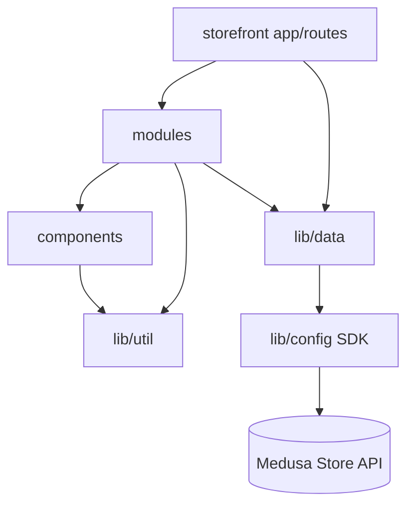

# ARCHITECTURE

Design of the DYLLU system: module boundaries, communication, rendering, state,
caching, security, and the trade-offs behind them. Index in
[PROJECT_MAP](PROJECT_MAP.md); flows in [DATA_FLOW](DATA_FLOW.md).

## Overall architecture

Three deployable units around one commerce engine:

```mermaid
flowchart LR
  subgraph Edge[Cloudflare]
    SF[Storefront Worker\nNext.js 16 / OpenNext]
    R2[(R2: images + next cache)]
    D1[(D1: tag cache)]
    DO[(Durable Object: cache queue)]
  end
  subgraph Origin[Hetzner + Coolify]
    BE[Medusa v2 backend\n+ bundled admin /backend]
    PG[(Postgres)]
    RD[(Redis)]
  end
  CA[catalog-admin\n(local, SQLite)]
  User((Shopper)) -->|HTTPS dyllu.md| SF
  SF -->|Store REST + JS SDK\napi.dyllu.md| BE
  SF --> R2 & D1 & DO
  BE --> PG & RD
  BE -->|S3 API| R2
  CA -->|Admin REST\n(publish)| BE
  CA --> CDB[(catalog.db\nSQLite)]
  BE -->|POST /api/revalidate| SF
```

- **Storefront ↔ backend:** HTTP only, via the Medusa **Store API** (JS SDK).
  Publishable key scopes it to a Sales Channel; region drives pricing.
- **catalog-admin ↔ backend:** HTTP via the Medusa **Admin API** with an admin
  secret key (HTTP Basic). Deliberately no shared code — Medusa stays upgradeable.
- **backend → storefront:** one webhook-style call, `POST /api/revalidate`, to
  invalidate Next cache tags after catalog changes.

## Module boundaries

### Backend (Medusa)

Medusa provides the domain modules (product, cart, order, pricing, region,
fulfillment, payment). Custom code is confined to Medusa's extension points:
`api/` (routes), `workflows/`, `subscribers/`, `jobs/`, `links/`, `modules/`,
`scripts/`. Cross-cutting concerns are centralized: **all** request validation,
auth, and security headers are declared in `src/api/middlewares.ts`; **all** Zod
contracts live in `src/api/_shared/contracts.ts`. Env parsing is isolated in
`src/config/environment.ts` and consumed by `medusa-config.ts`.

### Storefront (Next.js)

Three layers, strictly directional (upper may import lower, never the reverse):

```
app/ (routes)  →  modules/<feature>/ (domain UI + logic)  →  components/ (design system)
                                    ↘  lib/data/ (server-only fetchers) → lib/config.ts (SDK)
                                    ↘  lib/util/ (pure helpers)
```

- `components/` (atoms→molecules→organisms→templates) is domain-agnostic and dumb.
- `modules/<feature>/` holds feature composition + presentation logic
  (`modules/products/lib/product-presentation.ts` is the largest).
- `lib/data/*` is the **only** sanctioned Medusa access path; everything is
  `server-only`.

### catalog-admin

A self-contained authoring app: Drizzle schema (`drizzle/schema.ts`) over
`data/catalog.db`, query/derivation logic in `src/lib/*`, UI in `src/app/*` with
server actions for mutations. The Medusa bridge is the single file
`src/lib/medusaAdmin.ts` + `toMedusaProduct.ts` (payload builder).

## Dependency graph (import direction)



No circular dependencies by design. `components/` never imports `modules/` or
`lib/data`. See [DEPENDENCIES](DEPENDENCIES.md) for package-level detail and
circular-risk notes.

## Rendering model

- **Server Components by default.** Data fetching happens in RSC via `lib/data/*`.
  `"use client"` is confined to leaf interactive islands (cart drawer, variant
  pickers, forms, carousels).
- Route groups separate concerns: `(main)` carries site chrome (header/footer via
  `(main)/layout.tsx`); `(checkout)` is bare. `account/` uses **parallel routes**
  (`@dashboard` / `@login`) to switch on auth.
- Mutations are **Server Actions** (`"use server"`), e.g. all cart operations in
  `lib/data/cart.ts`. Forms post to actions; optimistic UI uses React 19 hooks.
- Production runtime is the **Cloudflare Workers** runtime (via OpenNext), not
  Node — code must be edge-compatible (Web Crypto over Node `crypto`, etc.).

## State management

- **Server-owned commerce state.** The cart lives in Medusa; the browser holds only
  the cart id in the `_medusa_cart_id` cookie. Cart reads/writes go through server
  actions that read the cookie, call Medusa, then `revalidateTag`.
- **Zustand** for small client-only UI state (e.g. `lib/stores/showcase-pinned.ts`);
  not used for authoritative commerce data.
- **React context** kept minimal (`lib/context/modal-context.tsx`).
- Region/locale flow via cookies + an `x-medusa-locale` header injected by the SDK
  wrapper in `lib/config.ts`.

## Caching

- **Next data cache with tags.** Fetchers tag responses; invalidation is
  centralized in `src/app/api/revalidate/route.ts`, which accepts only an allowlist
  of tags (`products`, `categories`, `collections`, `compatible-accessories`) and
  requires a constant-time secret match. `revalidateTag(tag, "max")`.
- **OpenNext cache backends on Cloudflare:** incremental cache in **R2**
  (`NEXT_INC_CACHE_R2_BUCKET`), tag cache in **D1** (`NEXT_TAG_CACHE_D1`), revalidation
  queue in a **Durable Object** (`NEXT_CACHE_DO_QUEUE`).
- **Edge middleware** sets a 7-day `_medusa_cache_id` cookie for per-visitor cache
  keying, and applies legacy product-handle 301 redirects from a static JSON map.
- Some hot reads use `cache: "no-store"` (e.g. product listing) to stay region- and
  price-accurate; caching is applied where correctness allows.
- Backend event bus + workflow engine + locking are **Redis-backed in
  production**, in-memory in dev (config branches on `REDIS_URL`).

## Authentication & authorization

- **Storefront → Store API:** publishable API key (Sales Channel scope). Customer
  auth uses Medusa's JWT/session; auth headers are attached in `lib/data/cookies.ts`.
- **Admin API:** session / bearer / API-key via Medusa's `authenticate("user", …)`.
  Admin routes declare **policies** (resource + operation) in `middlewares.ts`
  (e.g. `ai-edit/apply` requires `product:update`).
- **catalog-admin → Admin API:** admin secret key over HTTP Basic; publishing is
  **disabled** unless `CATALOG_MEDUSA_ADMIN_URL` + `CATALOG_MEDUSA_ADMIN_KEY` are
  set, with mandatory dry-run before any write (`PUBLISH.md`).
- **Order-transfer links** are gated by `ORDER_ACCESS_SECRET` (token in URL).

## Error handling & logging

- **Backend:** routes wrap handlers and funnel failures through
  `src/api/_shared/logging.ts` (`logRouteError`); contracts reject malformed input
  at the boundary (Zod, `.strict()`), so handlers trust their inputs.
- **Storefront:** the SDK wrapper in `lib/config.ts` enforces a 12s timeout and
  re-throws opaque `TimeoutError`/`AbortError` DOMExceptions as plain, debuggable
  Errors so a slow/unreachable backend fails honestly. `lib/util/medusa-error.ts`
  normalizes SDK errors. Route-level `error.tsx` / `not-found.tsx` render fallbacks.
  Fetch full-URL logging is enabled in `next.config.ts`.
- Cloudflare **observability** is on in `wrangler.jsonc` (logs + 10% trace
  sampling).

## Configuration & environment variables

- **Backend** env is Zod-validated in `src/config/environment.ts`, which enforces a
  `PRODUCTION_REQUIRED_KEYS` set (DB, Redis, CORS trio, JWT/cookie secrets,
  `STOREFRONT_URL`, `REVALIDATE_SECRET`, all S3 keys) and **rejects placeholder
  secrets** (min length 32; blocked words like `changeme`, `development`). S3/R2 and
  Redis modules load only when their env is present.
- **Storefront** required env is checked by `check-env-variables.js` at
  build/start; Cloudflare secrets (`REVALIDATE_SECRET`, `ORDER_ACCESS_SECRET`) are
  declared in `wrangler.jsonc`; `MEDUSA_BACKEND_URL` is a Worker var.
- **Production env changes are governed by hard rules** — see [AGENTS.md](AGENTS.md):
  never invent values, inventory before changing, no new required var in a single
  rollout, present facts + rollback + wait for approval.

## Performance considerations

- Edge delivery of the storefront (Cloudflare Workers) close to users; static assets
  and Next incremental cache served from R2.
- Custom Next image loader (`lib/util/image-loader.ts`) points at R2/`cdn.dyllu.md`;
  `next/image` with explicit dimensions from Medusa.
- Product listing fetch batches with a concurrency cap
  (`CATALOG_FETCH_CONCURRENCY = 4`) and page size 100.
- Small `"use client"` islands keep JS shipped to the browser minimal; heavy
  animation libs (Framer Motion, Lenis, Embla) live behind client leaves.
- Security headers set at both Next (`next.config.ts`) and Medusa
  (`middlewares.ts`) layers.

## Scalability decisions

- Stateless storefront workers scale horizontally on Cloudflare; all session/cart
  state is in Medusa/Postgres, cache state in R2/D1/DO.
- Backend concurrency-sensitive work (event bus, workflows, locking) is delegated to
  Redis in production so multiple backend instances coordinate safely.
- Catalog authoring is decoupled from runtime: heavy spec/normalization batch work
  runs offline in catalog-admin + Python tools, and only clean data is published to
  Medusa.

## Architectural principles

1. **Medusa stays vanilla.** No forks; extend via official points and the Admin
   API. Upgradeability over convenience.
2. **One sanctioned data path** per concern (storefront reads via `lib/data`;
   backend contracts in one file). No ad-hoc `fetch`, no scattered validation.
3. **Server-first, small client islands.** Correctness and payload size over SPA
   ergonomics.
4. **Boundary validation only.** Trust internal callers; validate user/external
   input with Zod. (CLAUDE.md: no defensive checks for impossible cases.)
5. **Production availability is paramount** (AGENTS.md) — safe-by-default, no
   one-step required-env rollouts, verify before mutate.

## Important trade-offs

- **`middleware.ts` not `proxy.ts`** — Next 16 prefers `proxy.ts`, but the
  OpenNext/Cloudflare adapter rejects Node middleware (issue #962); the repo keeps
  the working `middleware.ts` and documents the revert condition in-file.
- **`cache: "no-store"` on product lists** — trades cacheability for guaranteed
  region-accurate pricing.
- **Catalog master in SQLite** — a single-writer local DB is simple and fast for
  authoring/QA but is not multi-user; it is intentionally not the runtime store.
- **AI-edit routes dev-only** — powerful admin editing is hard-disabled in
  production (503) to avoid exposing an unfinished surface.
- **`typescript.ignoreBuildErrors` inherited from the starter** — a temporary
  regression; each refactored storefront module must pass `tsc --noEmit`, and the
  flag lifts once clean (CLAUDE.md).
