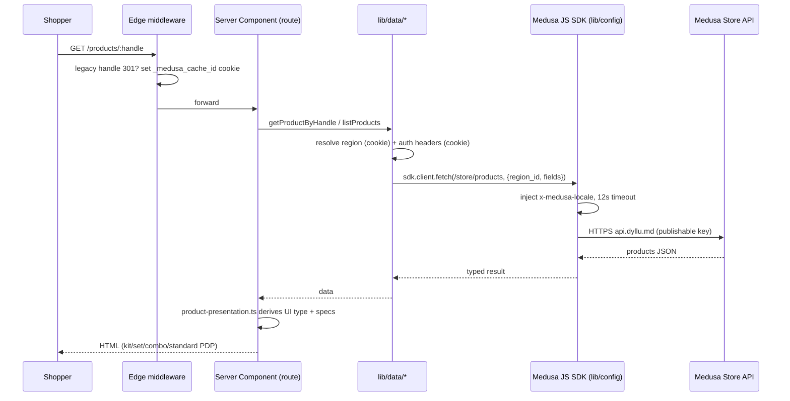
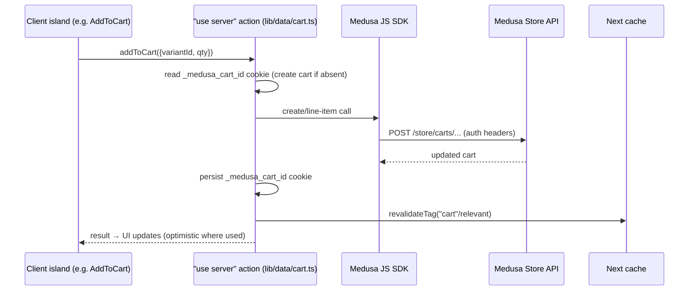
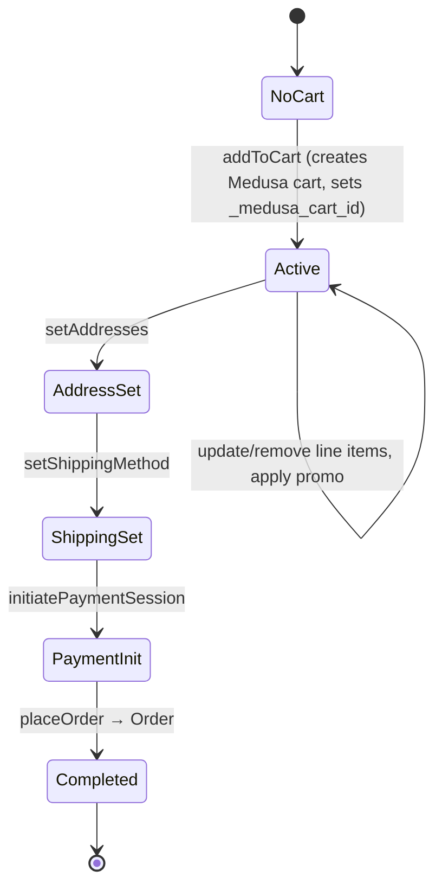
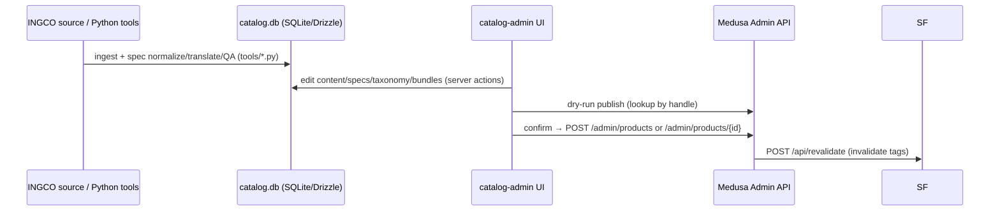

# DATA_FLOW

How data moves through DYLLU: request/response, server/client, state transitions,
events, async work, and cache lifecycle. Surfaces are catalogued in
[API_MAP](API_MAP.md); the reasoning behind these flows is in
[ARCHITECTURE](ARCHITECTURE.md).

## Read path (page render)



- **Region** is resolved from cookies before every price-sensitive fetch
  (`lib/data/regions.ts`); without it, listings return empty.
- **PDP polymorphism:** `getProductUiType(product)` selects one of
  `KitProductTemplate` / `SetProductTemplate` / `ComboProductTemplate` /
  `SharedProductLayout` (`modules/products/templates/index.tsx`).

## Client flow (interactivity)

- Server-rendered HTML hydrates only small `"use client"` islands: cart drawer,
  variant/option pickers, quantity steppers, forms, carousels, search command.
- Client islands never fetch Medusa directly; they call **server actions** or
  navigate. Transient UI state uses Zustand (`lib/stores/*`) or local state.

## Write path (cart mutation via Server Actions)



Cart actions in `lib/data/cart.ts`: `retrieveCart`, `addToCart`, `updateLineItem`,
`deleteLineItem`, `setShippingMethod`, `initiatePaymentSession`, `applyPromotions`,
`setAddresses`, `placeOrder`, `listCartOptions`. The whole file is `"use server"`.

## State transitions

### Cart lifecycle



- Authoritative state is server-side in Medusa; the browser holds only the cart id.
- MAIB payment provider is deferred; current flows use manual/test payment.

### Order transfer

`order/[id]/transfer/[token]` (view / accept / decline) is gated by
`ORDER_ACCESS_SECRET`; token in URL authorizes the transfer action.

## Catalog authoring & publish flow



- Backend ingest scripts (`src/scripts/ingco-*`) populate/seed Medusa directly for
  bulk operations; catalog-admin publishes curated products individually.
- catalog-admin never writes to Medusa's DB — only via the Admin API.

## Event flow (backend, async)

- Medusa's **event bus** (Redis in prod, in-memory in dev) dispatches domain events;
  extension points `subscribers/`, `jobs/`, and `workflows/` react to them
  (currently README stubs — reserved). Job options (retention on complete/fail) set
  in `medusa-config.ts`.
- **Workflow engine** and **locking** are Redis-backed in production for
  multi-instance coordination.

## Cache lifecycle

```mermaid
flowchart LR
  A[fetch in lib/data with tag] --> B[Next data cache]
  B --> C{revalidateTag}
  C -->|POST /api/revalidate\n(secret + allowlist)| B
  subgraph Cloudflare
    R2[(R2 incremental cache)]
    D1[(D1 tag cache)]
    DO[(DO revalidation queue)]
  end
  B -.OpenNext.-> R2 & D1 & DO
```

- Tags in play: `products`, `categories`, `collections`, `compatible-accessories`
  (allowlist enforced in `src/app/api/revalidate/route.ts`).
- Invalidation is **authenticated** (constant-time secret compare) and triggered by
  the backend after catalog changes.
- On Cloudflare, OpenNext maps Next's cache to R2 (data), D1 (tags), and a Durable
  Object (queue). The `_medusa_cache_id` cookie (set in edge middleware, 7-day TTL)
  keys per-visitor caching.
- Hot, price-sensitive reads opt out with `cache: "no-store"` (e.g. product listing)
  to stay region-accurate.

## Async operations summary

| Operation                         | Mechanism                    | Where                                         |
| --------------------------------- | ---------------------------- | --------------------------------------------- |
| Product/category/collection reads | RSC + tagged fetch           | `lib/data/*`                                  |
| Cart & checkout mutations         | Server Actions               | `lib/data/cart.ts`                            |
| Cache invalidation                | Webhook → `revalidateTag`    | `api/revalidate`                              |
| Catalog publish                   | Admin REST (dry-run→confirm) | catalog-admin `lib/medusaAdmin.ts`            |
| Bulk catalog ingest               | CLI scripts                  | backend `src/scripts/ingco-*`                 |
| Spec normalize/translate/QA       | Python batch jobs            | `tools/*.py` → `catalog.db`                   |
| Domain events                     | Redis event bus              | backend `subscribers/`, `jobs/`, `workflows/` |
