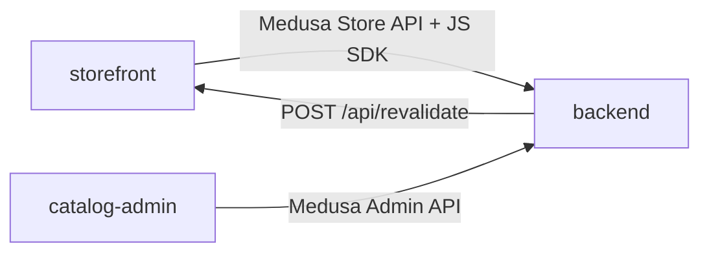

# DEPENDENCIES

Internal and external dependencies, the rationale behind key choices, and
circular-risk notes. Package manifests are the source of truth
(`apps/*/package.json`, root `package.json`).

## Workspace layout

pnpm workspaces: `apps/*` and `packages/*` (`packages/` is currently empty).
`apps/backend/.medusa/**` is excluded from the workspace. `.npmrc` sets
`auto-install-peers=true` (Medusa requires it). Root pins toolchain: `turbo`,
`typescript`, `eslint`, `prettier` (+ `prettier-plugin-tailwindcss`), `husky`,
`lint-staged`. Node ≥ 22.12 (`engines`), pnpm 10.19.

## Internal dependencies (between apps)

There are **no shared code packages**; apps integrate over HTTP:

- `storefront` → `backend`: `@medusajs/js-sdk` + `@medusajs/types`. Runtime coupling
  only (publishable key, region, Store API shape).
- `catalog-admin` → `backend`: plain `fetch` to the Admin REST API (no SDK, no shared
  types) — intentional, to keep Medusa upgradeable.
- `backend` → `storefront`: revalidate webhook (secret-authenticated).

Version alignment: backend and storefront pin release-aligned Medusa packages to
**2.18.0**, with `@medusajs/ui` at **4.2.0**. Next is **16.2.10** and React is
**19.2.4** in the storefront/catalog-admin; backend admin uses React 18. Keep each
ecosystem in lockstep when upgrading.

## External libraries by app

### backend (`@dyllu/backend`)

| Package                                                      | Why                                                        |
| ------------------------------------------------------------ | ---------------------------------------------------------- |
| `@medusajs/*` 2.18.0 (with `@medusajs/ui` 4.2.0)             | Commerce engine + bundled admin                            |
| `ioredis`                                                    | Redis client (event bus, workflow engine, locking in prod) |
| `@tanstack/react-query`, `react-router-dom`, `react-i18next` | Admin UI runtime                                           |
| `zod` 4 (via `@medusajs/framework/zod`)                      | API contracts / env validation                             |
| `cheerio` (dev)                                              | INGCO scraping in `scripts/ingco-*`                        |
| `jest`, `@swc/jest`, `@medusajs/test-utils`                  | Testing                                                    |
| `tsx`, `ts-node`                                             | Run TS scripts                                             |

### storefront (`@dyllu/storefront`)

| Package                                                                                                           | Why                                           |
| ----------------------------------------------------------------------------------------------------------------- | --------------------------------------------- |
| `next` 16.2.10, `react`/`react-dom` 19.2.4                                                                        | Framework                                     |
| `@medusajs/js-sdk`, `@medusajs/types`, `@medusajs/ui-preset`, `@medusajs/icons`                                   | Medusa client + design tokens                 |
| `@opennextjs/cloudflare`, `wrangler`                                                                              | Build/deploy to Cloudflare Workers (R2/D1/DO) |
| `@radix-ui/*`                                                                                                     | Accessible primitives behind atoms            |
| `class-variance-authority`, `clsx`, `tailwind-merge`, `tailwindcss` 3, `tailwindcss-animate`, `tailwindcss-radix` | Styling system                                |
| `framer-motion`, `lenis`, `embla-carousel*`                                                                       | Motion / smooth scroll / carousel primitive   |
| `zustand`                                                                                                         | Small client UI state                         |
| `cmdk`                                                                                                            | Command palette (`SearchCommand`)             |
| `sonner`, `vaul`, `@headlessui/react`                                                                             | Toasts, drawer, misc UI                       |
| `lucide-react`, `react-country-flag`                                                                              | Icons / flags                                 |
| `qs`, `lodash`, `server-only`                                                                                     | Query strings, utils, server guard            |
| `@playwright/test` (dev)                                                                                          | e2e                                           |

### catalog-admin (`catalog-admin`)

| Package                                                                                               | Why                                           |
| ----------------------------------------------------------------------------------------------------- | --------------------------------------------- |
| `next` 16.2.10, `react` 19.2.4                                                                        | Framework                                     |
| `better-sqlite3` + `drizzle-orm` (+ `drizzle-kit`)                                                    | Local catalog DB & migrations                 |
| `@base-ui/react`, `shadcn`, `tailwindcss` 4 (`@tailwindcss/postcss`), `tw-animate-css`, `next-themes` | UI system (separate from storefront)          |
| `class-variance-authority`, `clsx`, `tailwind-merge`, `lucide-react`, `sonner`                        | Styling/icons/toasts                          |
| `zod` 3                                                                                               | Validation                                    |
| `vitest`, `@playwright/test` (dev)                                                                    | Testing                                       |
| Python tools (`tools/*.py`, run via `python3`/`uv`)                                                   | Spec QA/normalize/translate/registry pipeline |

## Shared utilities

- **Storefront:** `lib/util/*` (money, product, image-loader, medusa-error,
  get-product-price, sort-products, compare-addresses, env…), `lib/utils.ts` (`cn`),
  `lib/config.ts` (SDK singleton).
- **Backend:** `src/api/_shared/{contracts,logging}.ts`, `src/config/environment.ts`.
- **catalog-admin:** `src/lib/*` (spec/normalization/saleReadiness/taxonomy/medusa
  bridge), `src/db/client.ts`.
- Cross-app sharing today happens only through the **Medusa API contract**, not
  code. If genuine code sharing emerges (e.g. product types), that is the reason
  `packages/` exists.

## Feature dependency notes

- **PDP** depends on `lib/data/products` + `modules/products/lib/product-presentation`
  - the four product templates + several organisms (`pdp-hero*`, `product-specs`,
    `linked-products`, `set-breakdown`) + `lib/data/compatible-accessories` (→ backend
    custom route). Touch the fetch `fields` and presentation together.
- **Homepage** depends on `lib/homepage/{types,home.config}` +
  `templates/homepage-renderer` + section organisms — a 4-file change to add a block.
- **Cart/checkout** depend on `lib/data/cart` (server actions) + `modules/cart` +
  `modules/checkout` + region/fulfillment/payment data modules.
- **Publish** depends on `catalog.db` schema (`drizzle/schema.ts`) +
  `lib/toMedusaProduct` + `lib/medusaAdmin` + env keys.

## Circular dependency risks

- Enforced import direction (routes → modules → components; modules → lib/data →
  SDK) keeps the storefront acyclic. **Risk:** a `components/*` (design system) file
  importing from `modules/*` or `lib/data` — this inverts the layering and can
  create cycles. Keep atoms/molecules/organisms data-agnostic (props in).
- `lib/util/*` must stay pure and not import `lib/data/*` (which is `server-only`),
  or client bundles break.
- Backend: keep contract types in `_shared/contracts.ts` one-directional (routes
  import contracts, not vice-versa).

## Rationale for notable choices

- **Medusa (not a rebuilt cart):** proven v2 commerce primitives; extended only via
  official points + Admin API to stay upgradeable (`PUBLISH.md`).
- **OpenNext + Cloudflare Workers (not Vercel for prod):** edge delivery near
  Moldova users; R2 for images/cache, D1 for tags, DO for the revalidation queue.
  (Vercel remains an option/history; current prod target is Cloudflare — see
  `docs/DEPLOYMENT-STATE.md`.)
- **SQLite/Drizzle for the catalog master:** fast local single-writer authoring and
  batch spec processing, decoupled from the runtime store.
- **pnpm overrides** (root `package.json`): pin transitive deps for security/build
  stability (axios, form-data, esbuild, vite, protobufjs, lodash, etc.).

## Upgrade cautions

- Keep `@medusajs/*` versions identical across backend + storefront (+ types).
- Next 16 / React 19 are pinned exact — bump storefront and catalog-admin together
  and re-check OpenNext compatibility (`@opennextjs/cloudflare`, `wrangler`).
- After Cloudflare binding changes, run `pnpm -F @dyllu/storefront cf-typegen`.
- Bumping OpenNext may finally allow the `middleware.ts` → `proxy.ts` rename
  (tracked in-file).
