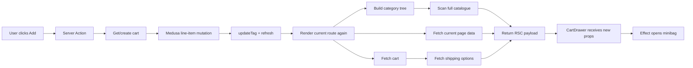
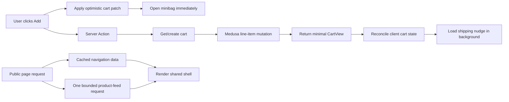

# Storefront Performance Remediation Plan

**Date:** 2026-07-30  
**Status:** Proposed  
**Scope:** Public storefront rendering, product feeds, cart mutations, minibag
updates, cache behaviour, and performance observability.

## Goal

Make the storefront feel immediate without weakening cart, price, stock, locale,
or checkout correctness.

The first visible response to a cart action must happen immediately. Public page
renders must stop scanning the full catalogue. Product feeds must do bounded,
server-side pagination. User-specific cart and customer work must not block the
shared public shell.

## Verified baseline

Measurements were taken against production on 2026-07-30 from the same client
connection:

| Flow                                | Observed result |
| ----------------------------------- | --------------: |
| Homepage TTFB                       |     3.58–4.29 s |
| Store TTFB                          |     2.81–2.97 s |
| Store response completion           |     6.37–7.25 s |
| Product page visible render         |          3.04 s |
| Existing-cart add → minibag visible |          7.21 s |
| Cart delete → empty state visible   |          4.18 s |
| Backend `/health` TTFB              |     0.14–0.17 s |

The homepage, store, and product responses returned:

```text
Cache-Control: private, no-cache, no-store, max-age=0, must-revalidate
```

Core Web Vitals were not captured because Chrome DevTools MCP is not configured.
The timings above are wall-clock navigation and interaction timings, not field
LCP, INP, or CLS values.

## Performance budgets

These are release criteria, not aspirations:

| Metric                                       |   Target |
| -------------------------------------------- | -------: |
| Cart click → visible pending feedback        | ≤ 100 ms |
| Cart click → minibag opens with pending item | ≤ 150 ms |
| Existing-cart mutation settled, p75          |  ≤ 1.0 s |
| Existing-cart mutation settled, p95          |  ≤ 2.0 s |
| Public-page TTFB, p75                        | ≤ 800 ms |
| Public-page TTFB, p95                        |  ≤ 1.5 s |
| LCP, p75                                     |  ≤ 2.5 s |
| INP, p75                                     | ≤ 200 ms |
| CLS, p75                                     |    ≤ 0.1 |
| Product-feed backend calls per page          |        1 |
| Full-catalogue scans during a normal request |        0 |

## Current production facts

- Storefront: Next.js 16.2.11 and React 19.2.4 on Cloudflare Workers through
  `@opennextjs/cloudflare`.
- Shared Next cache infrastructure already exists:
  - R2 incremental cache: `dyllu-next-cache`
  - D1 tag cache: `dyllu-tag-cache`
  - Durable Object queue: `NEXT_CACHE_DO_QUEUE`
- Backend: Medusa 2.18 at `https://api.dyllu.md`.
- The backend already calls the protected storefront revalidation endpoint after
  catalogue scripts.
- The revalidation endpoint already allows `products`, `categories`,
  `collections`, and `compatible-accessories`.
- Product pages are intentionally `force-dynamic` because on-demand ISR writes
  previously failed in the Worker.
- No new environment variable is required by this plan.
- This plan does not change production configuration, catalog data, seeds, or
  migrations.

Before any production deployment, re-inventory the actual Cloudflare and backend
configuration. Do not rely only on this document if the deployment state has
changed.

## Root causes

### P0 — Navigation scans the complete catalogue on every render

`apps/storefront/src/app/(main)/layout.tsx` calls `getCategoryTree()` for every
main route.

`getCategoryTree()`:

1. fetches the complete category hierarchy with `cache: "no-store"`;
2. calls `listProductsWithSort({ fetchAll: true })`;
3. pages through every product in batches of 100;
4. scans variants and categories to decide navigation visibility and images.

The function is wrapped in React `cache()`, but that only deduplicates work
within one render. It does not cache the result across requests.

The generic product field helper also adds product images, variant images, and
variant metadata to requests that only need an ID, thumbnail, category IDs, and
SKU. Navigation therefore transfers more data than its explicit field list
suggests.

**Effect:** every page and every cart-triggered refresh waits for catalogue work
that is unrelated to the requested content.

### P0 — The product feed fetches everything before showing 12 cards

`apps/storefront/src/modules/store/lib/product-feed.ts` always calls
`listProductsWithSort({ fetchAll: true })`, sorts and filters the complete result
inside the Worker, and only then slices the requested 12 cards.

The same process runs again for every infinite-scroll request. Cost grows with
the catalogue instead of remaining constant per page.

The feed expands multi-variant products into one card per variant. This means a
simple product-level `limit=12` change is not automatically equivalent to the
current variant-card pagination.

**Effect:** `/store` response completion is currently 6–7 seconds and will get
worse as the catalogue grows.

### P0 — Cart mutations force a complete route render

`apps/storefront/src/lib/data/cart.ts` calls `refresh()` after cart mutations.
It also calls `updateTag()` for scoped tags.

In Next.js 16, `refresh()` and immediate tag invalidation cause the Server Action
response to include a new React Server Component payload. The action therefore
does not settle until the current route has rendered again.

That render repeats:

- cart retrieval;
- category-tree generation;
- the current page's product work;
- shipping-option retrieval when a cart exists.

**Effect:** a normally small cart mutation inherits the cost of the whole page.

### P0 — The minibag has no independent cart state

Product components await `addToCart()` before showing their successful state.
`CartDrawer` opens only when a new server-rendered `cart` prop increases the
item count.

There is no optimistic item, optimistic badge, pending minibag, or central
client-side cart state.

**Effect:** the UI appears frozen while network and server rendering complete.

### P1 — Shipping options create a post-cart waterfall

The main layout first awaits cart retrieval. If a cart exists, it then fetches
shipping options before returning the shell.

The free-shipping popup is non-critical and does not need to block the header,
page content, cart badge, or minibag.

**Effect:** users with a cart get a slower page and a slower route refresh than
anonymous users.

### P1 — User state makes the shared public shell dynamic

The main layout retrieves cart and customer data for every public route.
Both paths read cookies. The SDK wrapper also checks a locale cookie before
Medusa requests.

The site currently has no locale-switching UI and renders Romanian globally,
but every SDK call still consults request-time locale state.

**Effect:** public responses are private and `no-store`, even when most content
is shared by every visitor.

### P1 — Homepage merchandising also scans full product sets

The homepage product rail calls `listProductsWithSort({ fetchAll: true })` to
select six products.

**Effect:** homepage TTFB pays for a full collection scan to render one small
rail.

### P1 — The RSC payload contains broader objects than the client needs

The header and cart drawer receive a complete Medusa cart object. React must
serialize that object across the Server/Client boundary even though the drawer
uses a small subset.

**Effect:** larger HTML and Server Action payloads, more parsing, and tighter
coupling between Medusa DTOs and UI components.

### P1 — There is no performance regression gate

The existing cart E2E test allows 20 seconds for the drawer to update. It proves
eventual correctness but permits severe regressions.

There is no production cart-action timing, route-level backend timing, or
automated request-count budget.

## Current cart flow



## Target architecture



## Data freshness policy

Do not apply one caching policy to all Medusa data.

| Data                                 | Policy                                                                 | Reason                    |
| ------------------------------------ | ---------------------------------------------------------------------- | ------------------------- |
| Category hierarchy                   | Cross-request cache, 5-minute backstop, tag invalidation               | Changes infrequently      |
| Navigation thumbnails and visibility | Cross-request cache, 5-minute backstop, `products` + `categories` tags | Shared merchandising data |
| Collections                          | Existing force-cache and tag invalidation                              | Changes infrequently      |
| Product descriptive content          | Cache only after invalidation coverage is verified                     | Shared catalogue data     |
| Price and inventory                  | `no-store` initially                                                   | Must remain authoritative |
| Product feed                         | `private, no-store`; one bounded backend query                         | Includes price and stock  |
| Cart and customer                    | `private, no-store`                                                    | User-specific             |
| Shipping options for a cart          | `private, no-store`, loaded after critical UI                          | Cart/address-dependent    |
| Region                               | Existing force-cache                                                   | Shared configuration      |

Do not cache price or inventory simply to improve a benchmark. First prove that
orders, admin changes, imports, price lists, and inventory adjustments all
invalidate the relevant cache.

## Phase 0 — Establish a reproducible baseline

### Work

1. Configure Chrome DevTools MCP:

   ```json
   "chrome-devtools": {
     "type": "local",
     "command": ["npx", "-y", "chrome-devtools-mcp@latest"]
   }
   ```

2. Capture cold and warm traces for:
   - `/`
   - `/store`
   - one single-variant PDP
   - one multi-variant PDP
   - existing-cart add
   - first-cart add
   - quantity update
   - item removal

3. Record:
   - TTFB, FCP, LCP, INP, CLS, TBT;
   - Server Action duration;
   - Medusa request count and duration;
   - RSC response size;
   - initial JavaScript transfer size;
   - image and font waterfalls.

4. Add a non-blocking performance result to Playwright output. Do not make CI
   timing assertions blocking until the test environment has stable hardware
   and data.

### Files

- Modify: `apps/storefront/e2e/cart-sync.spec.ts`
- Create: `apps/storefront/e2e/performance.spec.ts`
- Optional create:
  `apps/storefront/src/lib/observability/performance-marks.ts`

### Acceptance

- Every recorded timing has a route, device profile, network profile, date, and
  commit SHA.
- Cold and warm results are separated.
- The baseline does not create orders or modify catalog data.

## Phase 1 — Cache and reduce navigation data

This is the lowest-risk, highest-leverage first production change.

### Work

1. Create a dedicated navigation product query instead of calling the generic
   `listProductsWithSort()` path.

2. Request only fields required by navigation:
   - product ID;
   - thumbnail;
   - category IDs;
   - variant SKU.

3. Do not allow `withVisibilityFields()` to silently add product galleries,
   variant galleries, and variant metadata to this request.

4. Cache the category hierarchy and lightweight navigation product pages with:
   - `cache: "force-cache"`;
   - global `categories` and `products` tags;
   - a 300-second revalidation backstop.

5. Keep React `cache()` for same-render deduplication. Do not mistake it for
   cross-request caching.

6. Preserve current `navigation_hidden`, pinned SKU, and representative-image
   behaviour during this phase.

7. Verify the existing revalidation endpoint invalidates both navigation fetch
   groups after catalogue scripts.

### Files

- Modify: `apps/storefront/src/lib/data/categories.ts`
- Modify: `apps/storefront/src/lib/data/cookies.ts` only if the cache helper
  needs an explicit `revalidate` option
- Optional create:
  `apps/storefront/src/lib/data/navigation-products.ts`
- Verify: `apps/storefront/src/app/api/revalidate/route.ts`
- Verify: `apps/backend/src/scripts/_revalidate.ts`

### Important constraint

Do not change `listProducts()` globally from `no-store` to `force-cache`.
That function currently serves price and inventory data to several routes.
Navigation needs a separate, explicitly cacheable read path.

### Tests

- Category visibility is unchanged for empty, hidden, root, and nested
  categories.
- Pinned navigation images still win over fallback images.
- Two calls in one render issue one logical navigation load.
- A second request hits the shared cache.
- `products` invalidation refreshes representative images.
- `categories` invalidation refreshes hierarchy and metadata.
- A cache read failure fails visibly or falls back to Medusa; it must not return
  a fabricated empty navigation tree.

### Acceptance

- Warm navigation rendering performs zero Medusa catalogue requests.
- Navigation output is byte-for-byte equivalent for the current catalogue.
- Normal requests do not transfer product galleries or variant metadata for
  navigation.

### Expected impact

- Removes at least two catalogue requests, plus any follow-up product pages,
  from every warm route render.
- Expected TTFB reduction: 1–3 seconds. Confirm with traces.

### Rollback

Revert the dedicated cached query and restore the existing function call.
Orphaned R2/D1 entries are harmless and can expire naturally.

## Phase 2 — Replace full-catalogue product feeds

### Decision gate: define feed grain

The current UI expands a multi-variant product into one card per variant.
Medusa's standard product endpoint paginates products, not the expanded card
list.

Before implementation, choose one of these behaviours:

1. **Keep one card per variant.** Recommended if each variant needs independent
   pricing, stock, image, and quick-add behaviour. Implement backend pagination
   at variant-card grain.
2. **Use one card per product.** Simpler and compatible with Medusa product
   pagination, but changes the current storefront experience for multi-variant
   products.

Do not silently switch grain as an optimization.

### Recommended implementation

Add an additive Medusa Store API endpoint that returns the existing
`ProductFeedResponse` shape with bounded pagination.

Suggested route:

```text
GET /store/product-feed
```

Supported bounded inputs:

- cursor or page;
- limit, capped at 24;
- `created_at`, `price_asc`, or `price_desc`;
- collection ID;
- category IDs;
- tag ID;
- product IDs;
- search query;
- on-sale flag;
- region/currency context.

The backend must:

1. validate and cap every input;
2. apply publication and sales-channel rules;
3. preserve the selected product/variant grain;
4. calculate price through Medusa pricing APIs, not hand-written arithmetic;
5. calculate inventory through Medusa inventory rules;
6. sort and filter before pagination;
7. return a deterministic cursor and total when supported;
8. fetch related rows in batches, never one query per card;
9. return only the fields required by `PlpProductCard`.

If the installed Medusa Store Products API can perform the required price and
sale ordering correctly, use it. Otherwise implement the additive endpoint.
Do not pull the full catalogue into the Cloudflare Worker.

### Deployment order

1. Add and deploy the backend endpoint.
2. Verify it read-only in production with representative filters.
3. Update the storefront to use it.
4. Keep a temporary legacy fallback for endpoint 404/5xx.
5. Remove the fallback after one stable release.

This order keeps the old storefront functional while backend versions roll out.

### Files

- Create: `apps/backend/src/api/store/product-feed/route.ts`
- Optional create:
  `apps/backend/src/api/store/product-feed/validators.ts`
- Optional create:
  `apps/backend/src/services/product-feed.ts`
- Modify: `apps/storefront/src/modules/store/lib/product-feed.ts`
- Modify:
  `apps/storefront/src/modules/store/lib/product-feed-contract.ts`
- Modify:
  `apps/storefront/src/app/api/product-feed/route.ts`
- Modify:
  `apps/storefront/src/modules/store/components/infinite-products-grid.tsx`

### Cache policy

Keep the feed `private, no-store` initially because it includes current price and
stock. Performance must come from bounded backend work, not stale commerce data.

### Tests

- First, middle, and final pages.
- Stable ordering when multiple records have the same price or creation time.
- Multi-variant products at page boundaries.
- Category including descendant categories.
- Collection, tag, search, and explicit product-ID filters.
- Sale and non-sale products.
- Missing price.
- Out-of-stock and backorder variants.
- Invalid cursor, excessive limit, malformed IDs, and oversized query.
- Backend timeout and partial downstream failure.
- No duplicated or missing cards while infinite scrolling.
- Request count remains constant as fixture catalogue size grows from 100 to
  10,000 records.

### Acceptance

- One storefront request results in one bounded feed request.
- Runtime and transferred bytes do not grow linearly with total catalogue size.
- No request calls `listProductsWithSort({ fetchAll: true })`.
- Existing filter and sort semantics are preserved.

### Expected impact

- Expected `/store` response completion reduction: from 6–7 seconds to under
  2 seconds. Confirm in production.

### Rollback

Switch the storefront back to the temporary legacy fallback. The additive
backend endpoint can remain deployed because no existing caller depends on it.

## Phase 3 — Make cart mutations return cart state

### Cart view model

Create a minimal serializable `CartView` rather than passing a full Medusa cart
to Client Components.

Suggested shape:

```ts
type CartView = {
  id: string;
  currencyCode: string;
  itemTotal: number;
  subtotal: number;
  totalQuantity: number;
  items: Array<{
    id: string;
    variantId: string;
    productHandle: string;
    title: string;
    variantTitle?: string;
    thumbnail?: string;
    quantity: number;
    total: number;
  }>;
};
```

Do not expose auth headers, customer details, internal metadata, promotions,
region graphs, or unused Medusa fields.

### Server Action changes

For add, update, and delete:

1. keep all current identifier and quantity validation;
2. perform the Medusa mutation;
3. use the cart returned by Medusa when it contains all required fields;
4. otherwise perform one targeted cart retrieval;
5. map the result to `CartView`;
6. return it to the client;
7. do not call `refresh()` for cart item CRUD;
8. do not invalidate tags for cart reads that are explicitly `no-store`.

Categorize every existing `syncCartStorefront()` caller before deleting the
helper:

| Mutation                   | Target behaviour                               |
| -------------------------- | ---------------------------------------------- |
| Add item(s)                | Return `CartView`; no route refresh            |
| Update quantity            | Return `CartView`; no route refresh            |
| Delete item                | Return `CartView`; no route refresh            |
| Apply promotion on cart UI | Return `CartView`; no route refresh            |
| Address update             | Keep checkout redirect/refresh semantics       |
| Shipping method            | Keep checkout correctness; optimize separately |
| Payment initiation         | Keep authoritative checkout behaviour          |
| Order completion           | Keep redirect and order/cart invalidation      |

Do not globally remove refresh behaviour from checkout mutations.

### Multi-item adds

`addItemsToCart()` currently performs cart writes sequentially. Do not make
concurrent writes to the same cart: they can race and produce lost updates.

Initial change:

- keep writes serialized;
- return the final authoritative cart;
- apply all optimistic items immediately on the client.

Follow-up:

- verify whether the installed Medusa version provides a supported atomic
  multi-line cart workflow;
- if not, add one backend workflow/endpoint;
- deploy it additively before changing the storefront.

### Files

- Create: `apps/storefront/src/lib/cart/cart-view.ts`
- Create: `apps/storefront/src/lib/cart/cart-view.mapper.ts`
- Modify: `apps/storefront/src/lib/data/cart.ts`
- Modify every add-to-cart caller under:
  - `apps/storefront/src/components/organisms/`
  - `apps/storefront/src/modules/products/components/`
  - `apps/storefront/src/modules/cart/components/`

### Tests

- New cart creation returns a valid cart and sets the cookie.
- Existing cart add returns the updated quantity and totals.
- Update and delete return authoritative totals.
- Mapper strips unused and sensitive fields.
- Missing/malformed cart response fails closed.
- Medusa timeout does not leave permanent optimistic state.
- Two rapid adds do not overwrite each other.
- Multi-item add preserves input order and quantities.
- Checkout mutations retain their current redirects and validation.

### Acceptance

- Cart item CRUD action responses contain no full-route RSC refresh.
- A cart mutation performs only cart-related backend requests.
- Removing navigation or PDP work from the action response does not change cart
  correctness.

### Expected impact

- Removes roughly one full 3-second product-page render from each cart action.
- Authoritative existing-cart add should settle in 0.4–1.5 seconds under normal
  backend latency. Confirm with production traces.

## Phase 4 — Add a client cart provider and optimistic minibag

### Provider responsibilities

Create a client-only `CartProvider` with:

- authoritative `CartView | null`;
- optimistic patches;
- minibag open state;
- initial bootstrap state;
- mutation errors;
- a serialized mutation queue.

Suggested API:

```ts
type CartContextValue = {
  cart: CartView | null;
  isBootstrapping: boolean;
  isMutating: boolean;
  openCart(): void;
  closeCart(): void;
  addItem(input: AddItemInput, optimistic: OptimisticCartItem): Promise<void>;
  addItems(
    input: AddItemsInput,
    optimistic: OptimisticCartItem[]
  ): Promise<void>;
  updateItem(lineId: string, quantity: number): Promise<void>;
  removeItem(lineId: string): Promise<void>;
};
```

### Optimistic behaviour

On add:

1. update the badge immediately;
2. insert a pending line with product data already available to the card/PDP;
3. open the minibag immediately;
4. start the Server Action in a transition;
5. replace the pending state with returned `CartView`;
6. on failure, roll back the patch and show an actionable error.

Pending lines must be visibly pending. Do not present an optimistic price as
authoritative if the server may recalculate it.

### Concurrency

Users can click multiple product cards quickly. A last-response-wins strategy can
lose earlier optimistic updates.

Use a serialized server mutation queue:

1. apply every optimistic patch immediately;
2. send server mutations in order;
3. after each response, replace the authoritative base;
4. reapply optimistic patches still waiting in the queue;
5. roll back only the failed patch.

### Drawer changes

`CartDrawer` must consume provider state. Remove the effect that waits for a
server prop count increase. Opening the drawer becomes an explicit part of the
add interaction.

The badge, drawer, cart page controls, compatible accessories, PDP actions, and
PLP cards must all reconcile through the same provider.

### Files

- Create:
  `apps/storefront/src/components/providers/cart-provider.tsx`
- Create: `apps/storefront/src/lib/cart/cart-context.ts`
- Modify:
  `apps/storefront/src/components/organisms/cart-drawer.tsx`
- Modify:
  `apps/storefront/src/components/organisms/site-header.tsx`
- Modify:
  `apps/storefront/src/components/organisms/plp-product-card.tsx`
- Modify:
  `apps/storefront/src/components/organisms/pdp-hero.tsx`
- Modify:
  `apps/storefront/src/components/organisms/pdp-hero-variants.tsx`
- Modify:
  `apps/storefront/src/components/organisms/linked-products.tsx`
- Modify:
  `apps/storefront/src/modules/products/components/product-actions/index.tsx`
- Modify:
  `apps/storefront/src/modules/products/components/compatible-accessories/accessory-card.tsx`
- Modify:
  `apps/storefront/src/modules/cart/components/item/index.tsx`

### Tests

- Delay the Next Server Action request in Playwright and verify the drawer opens
  before the response is released.
- Badge count updates before the response.
- Successful response reconciles line ID, price, quantity, and subtotal.
- Failed response rolls back only the failed item.
- A pending item cannot be checked out.
- Double-click and rapid multi-card clicks remain idempotent at the UI layer.
- Remove and quantity updates are optimistic and reversible.
- Reload and navigation hydrate the authoritative server cart.
- Keyboard focus moves into the opened drawer and returns to the trigger when
  closed.

### Acceptance

- Pending feedback is visible in under 100 ms.
- The minibag opens in under 150 ms.
- The UI no longer waits for an RSC refresh to show cart changes.

### Rollback

Keep the Server Actions capable of returning `CartView`, but restore the
server-prop drawer and scoped refresh behaviour. This preserves a functional
fallback without reverting backend changes.

## Phase 5 — Remove user-specific work from the shared public layout

This phase enables shared public rendering to benefit fully from caching.

### Commerce shell bootstrap

Add a private, no-store endpoint:

```text
GET /api/commerce-shell
```

It returns a minimal payload:

```ts
type CommerceShellView = {
  cart: CartView | null;
  authenticated: boolean;
  cartMismatch: boolean;
};
```

The endpoint:

- reads the existing HTTP-only cookies;
- fetches cart and customer in parallel;
- returns only UI-required state;
- sends `Cache-Control: private, no-store`;
- never returns auth tokens or customer PII.

`CartProvider` calls it once after hydration. An add action can establish and
return authoritative cart state even if bootstrap has not completed.

### Main layout changes

Remove these blocking reads from
`apps/storefront/src/app/(main)/layout.tsx`:

- `retrieveCustomer()`;
- `retrieveCart()`;
- `listCartOptions()`.

The layout keeps cached categories and renders the shared shell immediately.

### Shipping nudge

Move the free-shipping nudge behind the cart provider:

1. do not request shipping options when no cart exists;
2. render the cart and page before shipping options;
3. load shipping options after the authoritative cart settles;
4. cancel stale requests when cart/address state changes;
5. keep checkout shipping validation on the server.

The nudge may appear later. It must never delay cart feedback.

### Cart mismatch

Render the mismatch banner from the private commerce-shell result. It is useful
only to authenticated users and must not block anonymous public rendering.

### Cart, account, and checkout routes

These routes remain dynamic and authoritative:

- `/cart`
- `/account/**`
- `/checkout/**`
- order routes

The cart page can server-render authoritative content, then hydrate the provider
from that content. Avoid a second bootstrap request when the page already has a
cart payload.

### Locale decision

The global SDK wrapper currently reads `_medusa_locale` before every request,
but no locale-switching caller exists and the root document is fixed to
Romanian.

Before changing this:

1. verify backend translated-field behaviour with no locale header and with
   `ro`;
2. confirm no external flow sets `_medusa_locale`;
3. decide whether the storefront is intentionally single-locale.

If single-locale is confirmed:

- use a static locale header for public catalogue reads;
- keep cart locale initialization explicit;
- remove public request-time locale cookie reads.

If multi-locale is planned, keep locale dynamic and accept that full-page edge
caching requires a locale-specific routing/cache design.

### Cache Components

Do not enable Next.js `cacheComponents` as part of this remediation. The current
application uses the previous caching model and has known OpenNext ISR
constraints. Use explicit `fetch` cache options and existing shared cache
handlers first. Consider Cache Components in a separate framework migration.

### Files

- Create: `apps/storefront/src/app/api/commerce-shell/route.ts`
- Create:
  `apps/storefront/src/lib/cart/commerce-shell-view.ts`
- Modify: `apps/storefront/src/app/(main)/layout.tsx`
- Modify:
  `apps/storefront/src/components/providers/cart-provider.tsx`
- Modify:
  `apps/storefront/src/components/organisms/site-header.tsx`
- Modify:
  `apps/storefront/src/modules/layout/components/cart-mismatch-banner/index.tsx`
- Modify:
  `apps/storefront/src/modules/shipping/components/free-shipping-price-nudge/index.tsx`
- Conditional modify:
  `apps/storefront/src/lib/util/get-locale-header.ts`
- Conditional modify:
  `apps/storefront/src/lib/data/locale-actions.ts`

### Tests

- Anonymous public page renders without cart/customer Medusa requests.
- Existing cart hydrates badge and drawer after shell render.
- Add during bootstrap produces one correct cart.
- Logged-in customer state and mismatch banner remain correct.
- Commerce endpoint never caches private data.
- Cart/account/checkout remain dynamic.
- Public navigation remains usable while the commerce endpoint is slow or
  unavailable.
- Free-shipping nudge failure does not affect cart or checkout.
- Locale behaviour is unchanged for products, categories, cart, and checkout.

### Acceptance

- Public layout does not read cart, customer, or shipping options.
- Public page response is no longer made private solely by the shared header.
- Cart bootstrap is one bounded private request.

## Phase 6 — Bound homepage and PDP work

### Homepage product rail

Remove `fetchAll: true` from the request-time homepage path.

For diverse merchandising:

1. build a cached list of eligible product IDs from lightweight, non-price
   fields;
2. invalidate it with `products` and `collections`;
3. deterministically select the six IDs;
4. fetch current price and stock only for those IDs;
5. render the rail behind its own Suspense boundary if traces show it blocks
   useful above-the-fold content.

Do not cache current price or inventory as part of the merchandising selection.

Alternative: add a bounded `selection=diverse` mode to the backend product-feed
endpoint.

### PDP

Use the Chrome trace before changing the PDP. Then:

- start independent accessory, included-item, and related-product requests in
  parallel;
- place non-critical related products behind Suspense;
- keep the SEO-critical title, selected variant, current price, and stock in the
  primary response;
- reduce Medusa fields to what each section actually consumes;
- avoid serializing the complete product graph into multiple Client
  Components.

Do not add image optimization work to the first performance PR unless the trace
shows image transfer or decode is a leading LCP contributor. The measured
problem is currently server wait.

### Files

- Modify:
  `apps/storefront/src/components/templates/homepage-renderer.tsx`
- Optional create:
  `apps/storefront/src/lib/data/homepage-products.ts`
- Modify:
  `apps/storefront/src/modules/products/templates/shared-product-layout.tsx`
- Modify:
  `apps/storefront/src/modules/products/components/related-products/index.tsx`
- Review:
  `apps/storefront/src/lib/data/included-accessories.ts`
- Review:
  `apps/storefront/src/lib/data/compatible-accessories.ts`

### Acceptance

- Homepage renders at most one bounded product request for the rail.
- Homepage selection remains deterministic for a cache generation.
- Current price and stock remain authoritative.
- Non-critical PDP sections cannot delay the buy box.

## Phase 7 — Add observability and regression gates

### Storefront backend timing

Instrument the centralized Medusa client wrapper with structured slow-request
logs:

- route/path template;
- method;
- duration;
- status;
- cache mode;
- timeout/error class;
- request correlation ID.

Never log:

- auth headers;
- JWTs;
- cookie values;
- cart IDs;
- customer IDs;
- addresses;
- request or response bodies.

Cloudflare logs and traces are already enabled. Use those facilities before
adding another telemetry vendor or environment variable.

### Cart interaction timing

Add browser marks:

```text
cart:add:start
cart:optimistic-visible
cart:drawer-open
cart:mutation-settled
cart:mutation-failed
```

Record duration distributions without product, cart, or customer identifiers.

### Request-count budgets

Add tests or trace assertions for:

| Flow                  | Maximum expected Medusa work                 |
| --------------------- | -------------------------------------------- |
| Warm homepage         | cached navigation + one bounded rail request |
| Warm store page       | cached navigation + one feed request         |
| Existing-cart add     | minimal cart read + one mutation             |
| First-cart add        | cached region + cart create + one mutation   |
| Cart drawer bootstrap | one cart read                                |

### CI gates

Run:

```bash
pnpm --filter @dyllu/storefront lint
pnpm --filter @dyllu/storefront typecheck
pnpm --filter @dyllu/storefront test
pnpm --filter @dyllu/storefront build
pnpm --filter @dyllu/storefront exec opennextjs-cloudflare build
```

Performance timing gates become blocking only after:

- the environment is stable;
- three successful baseline runs establish variance;
- test data is deterministic;
- cold-start and warm-run thresholds are separated.

Functional request-count and no-full-scan assertions can become blocking
immediately.

## Validation matrix

### Public rendering

- Homepage, store, category, collection, promo, and PDP routes.
- Anonymous, existing-cart, and authenticated states.
- Cold and warm shared caches.
- Catalogue with 100, 1,000, and 10,000 fixture records.
- Cache backend unavailable.
- Medusa slow, unavailable, malformed response, and timeout.

### Cart

- First add with no cookie.
- Existing cart add.
- Same variant added twice.
- Two different variants added rapidly.
- Multi-item tool + battery + charger.
- Quantity increase and decrease.
- Delete pending and settled items.
- Mutation failure and rollback.
- Login cart transfer.
- Promotion, shipping method, payment, and order completion.
- Refresh, back/forward navigation, and a second browser tab.

### Feed

- Every sort and filter.
- Variant-card page boundaries.
- New products inserted between cursor requests.
- Equal sort keys.
- Missing prices and images.
- Stock and backorder changes.
- Invalid and excessive inputs.

### Cache correctness

- Catalogue change followed by successful tag revalidation.
- Catalogue change when revalidation fails.
- Five-minute backstop refresh.
- R2/D1 cache visibility across Worker instances.
- No private cart/customer response stored in shared cache.
- No stale stock or price introduced by navigation caching.

### Accessibility and UX

- Drawer focus trap and focus restoration.
- Pending, success, and error announcements.
- Keyboard-only add/remove/update.
- Reduced-motion behaviour.
- No layout shift when private shell state hydrates.

## Production rollout

Deploy each phase separately. Do not combine cache, feed, cart state, and shell
changes into one release.

### Preflight before every production release

1. Review complete branch diff.
2. Run `git diff --check`.
3. Run required lint, typecheck, tests, Next build, and OpenNext build.
4. Inventory actual production variables and bindings read-only.
5. Confirm no new required variable is introduced.
6. Confirm current Worker version and rollback target.
7. Confirm backend container status, restart count, and public health.
8. Capture pre-deploy homepage, store, PDP, cart, and checkout timings.

### Release order

1. Navigation cache and field reduction.
2. Additive backend feed endpoint.
3. Storefront feed and homepage bounded queries.
4. Cart DTO-returning Server Actions.
5. Cart provider and optimistic minibag.
6. Shared-shell dynamic-state removal.
7. Optional PDP streaming changes.
8. Blocking performance budgets.

### Post-deploy verification

For every relevant release, verify:

- deployed Worker version is healthy;
- backend container is running with no restart increase;
- backend internal health check;
- public `https://api.dyllu.md/health`;
- backend admin endpoint;
- homepage;
- store;
- representative PDP;
- first-cart and existing-cart add;
- minibag;
- cart page;
- checkout entry;
- cache hit/miss behaviour;
- catalogue revalidation;
- production logs for new errors and timeouts.

Record exact timing values. Do not report only that pages “feel faster”.

### Rollback

- Storefront: restore the previous known-good Cloudflare Worker version.
- Backend feed: leave the additive endpoint deployed or restore the previous
  container; storefront fallback preserves service.
- Cache issue: revert cache usage first. Do not delete shared cache storage as a
  troubleshooting shortcut.
- Cart issue: restore the server-prop drawer and scoped refresh path.
- If production becomes unhealthy, stop optimization work and diagnose
  read-only before any rollback, migration, credential, or data action.

## Recommended pull-request sequence

1. `Measure storefront performance`
2. `Cache navigation data`
3. `Add paginated product feed`
4. `Use bounded storefront feeds`
5. `Return cart state from mutations`
6. `Add optimistic cart provider`
7. `Remove cart work from public layout`
8. `Add performance regression gates`

Each change must be independently deployable and reversible.

## Decisions required before implementation

1. Keep one PLP card per variant, or switch to one card per product?
2. Is the storefront permanently Romanian-only?
3. Which backend events outside catalogue scripts can change price or inventory?
4. Is a category metadata backfill allowed in a later, separately approved
   migration?
5. Should Chrome DevTools MCP be added to the shared engineering setup or only
   local Codex configuration?

## Optional long-term navigation cleanup

The current navigation derives images and visibility by scanning products. The
cleaner model is explicit category metadata:

- `navigation_hidden`;
- `nav_thumbnail_url`;
- optional merchandising rank.

After a separately approved catalog-data migration:

1. backfill metadata from the currently selected values;
2. verify navigation equivalence;
3. stop loading products to build navigation;
4. retain tag invalidation for category changes.

This is not part of the initial code-only performance fix because it modifies
catalog data and requires explicit approval.

## Definition of done

- No normal page request scans the full catalogue.
- Product-feed cost is bounded by page size.
- Cart item CRUD does not trigger a route refresh.
- Minibag pending state appears within 150 ms.
- Cart failures roll back cleanly.
- Shared public layout does not wait for cart, customer, or shipping options.
- Navigation uses the existing shared cache and invalidates correctly.
- Price, stock, checkout, and locale correctness are preserved.
- Production p75 budgets are met for seven consecutive days.
- Rollback procedures have been tested, not merely documented.
